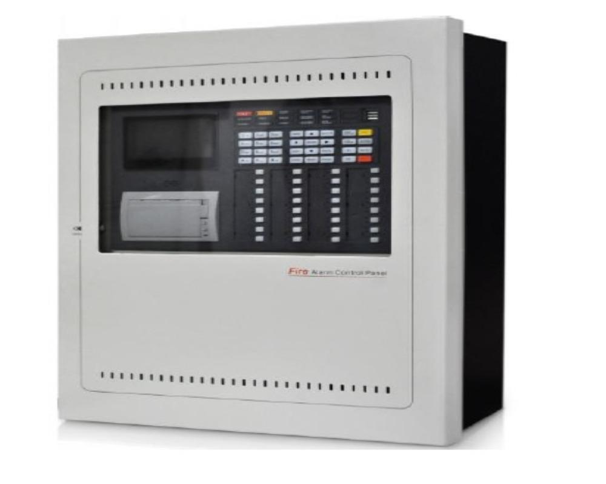
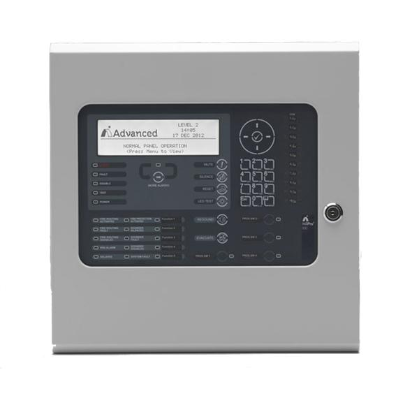
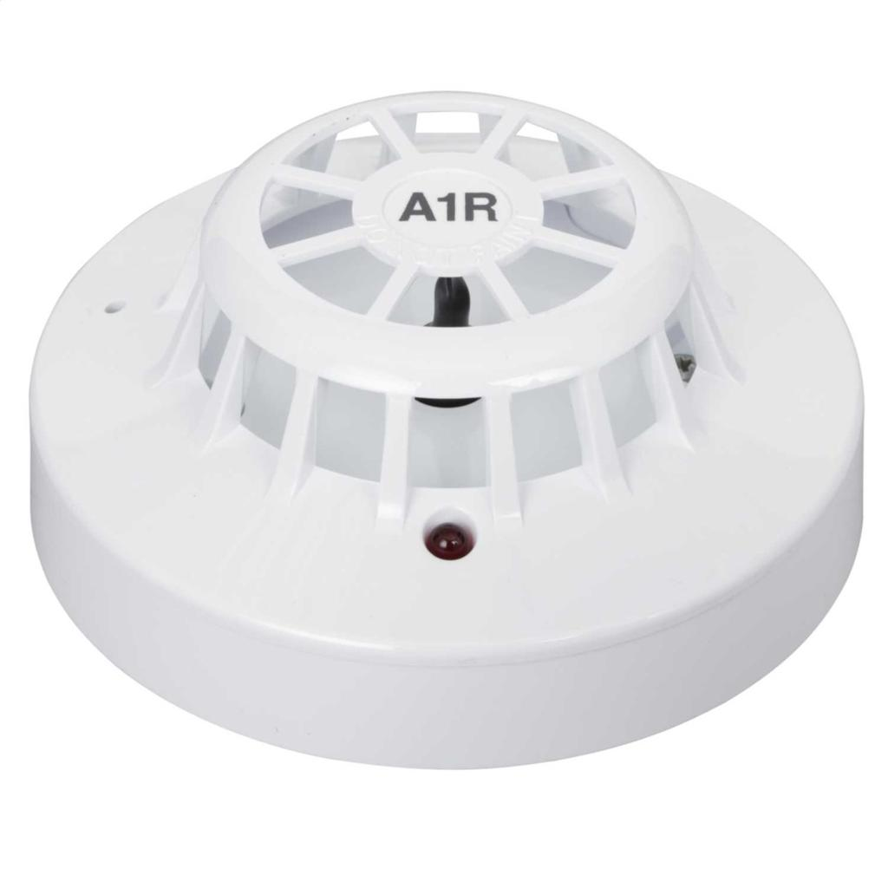
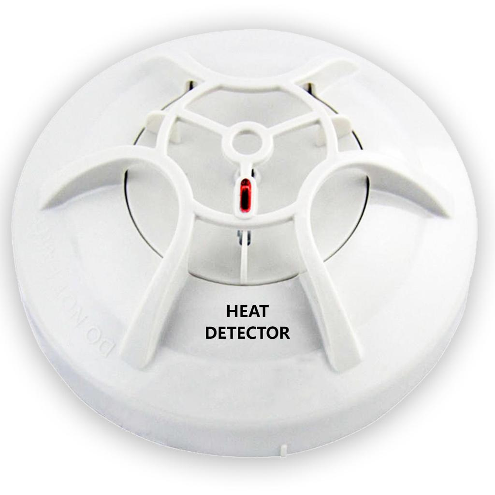
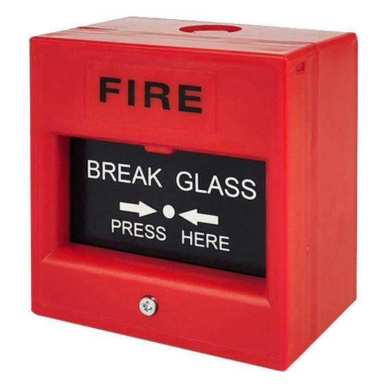

# FDAS Components
## FDAS System Overview

### Fire Alarm Control Panel (Type 1)

### Fire Alarm Control Panel (Type 2)

### Smoke Detector

### Heat Detector

### Manual Call Point (Break Glass)

## 1. Fire Alarm Control Panel (FACP)

The Fire Alarm Control Panel is the main control unit of the FDAS. It receives signals from detectors and activates alarm devices during fire events.

## 2. Smoke Detector

A device that detects smoke particles and sends an alarm signal to the Fire Alarm Control Panel.

## 3. Heat Detector

A detector that activates when it senses a high temperature or rapid increase in heat.

## 4. Manual Call Point (MCP)

A manual activation device used by people to trigger the fire alarm during an emergency.

## 5. Sounder / Alarm Bell

An audible alarm device that provides warning during a fire condition.

## 6. Strobe Light

A visual alarm indicator used to alert people, especially in noisy areas.

## 7. Monitor Module

A module used to monitor external devices and receive status signals.

## 8. Control Module

A module used to control external equipment connected to the fire alarm system.

## 9. Backup Battery

Provides power backup to keep the FDAS operating during power failure.
