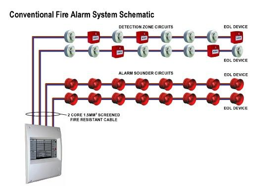
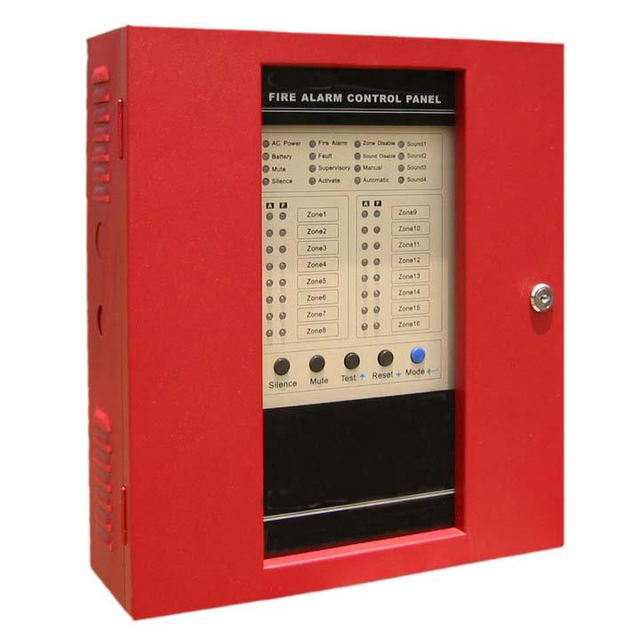
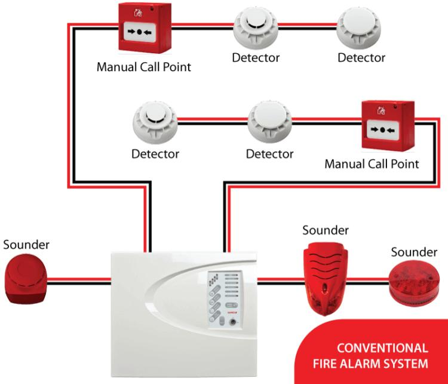

# Conventional FDAS Wiring Diagram

This section contains sample conventional Fire Detection and Alarm System (FDAS) wiring diagrams and control panel references.

## Conventional Wiring Diagram 1

## Conventional Fire Alarm Control Panel

## Conventional Wiring Diagram 2

